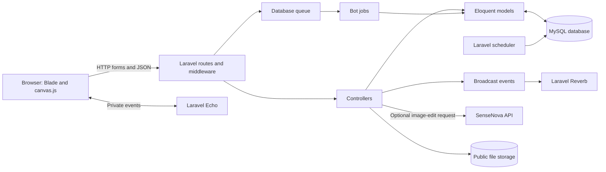

# Collaborative Drawing Website


A browser-based collaborative drawing application for two human participants. It supports real-time stroke synchronization, moderated reports and bans, configurable backgrounds, session completion, optional SenseNova image editing, and an administrator-curated drawing bot.

## Contents

- [System Architecture](#system-architecture)
- [Backend Design](#backend-design)
- [Database](#database)
- [HTTP API](#http-api)
- [Authentication and Security](#authentication-and-security)
- [Testing and Quality Assurance](#testing-and-quality-assurance)
- [AI Integration](#ai-integration)
- [Installation and Deployment](#installation-and-deployment)

## System Architecture

The application follows Laravel's Model-View-Controller organization. Blade templates render the landing, session, and administrative pages; controllers handle HTTP requests and coordinate Eloquent queries, validation, and domain actions. Laravel Reverb and Echo provide private-channel event delivery. Database-backed jobs handle delayed bot behavior, while a scheduled task removes inactive participants and old ended sessions.



### Design and folder layout

The repository does not implement a separate Repository or Service layer. Controllers use Eloquent models and Laravel facilities directly; background work is separated into queue jobs, and cross-client notifications are represented by event classes.

| Path | Responsibility |
| --- | --- |
| `app/Http/Controllers/` | Session, landing, background, bot-pattern, and administration request handling |
| `app/Http/Middleware/` | Banned-IP checks, administrator IP/session checks, and private-channel authorization |
| `app/Models/` | Eloquent records and relationship definitions |
| `app/Events/` | Private Reverb broadcasts for session changes and strokes |
| `app/Jobs/` | Delayed bot joining and bot drawing execution |
| `routes/web.php`, `routes/channels.php` | Browser/JSON routes and private broadcast channel authorization |
| `resources/views/` | Blade pages for the public application and admin panel |
| `public/js/canvas.js` | Canvas interaction, client synchronization, and AI request handling |
| `database/migrations/` | Application and Laravel framework table definitions |
| `tests/Feature/` | HTTP/domain integration tests using an in-memory SQLite database |

## Backend Design

The backend is built with Laravel 13 and PHP 8.3 or later. HTTP routes are defined in `routes/web.php`; they use Laravel's web middleware stack, including session and CSRF protections. The application primarily serves HTML and form redirects, with JSON responses for session state, stroke, finish, and AI operations. These routes are not a separately versioned `routes/api.php` API.

`SessionController` implements session creation and joining, participant presence, stroke persistence, finish-state transitions, reset, and SenseNova image generation. `AdminController`, `BackgroundController`, and `BotPatternController` implement administrative management. `AdminAuthController` provides the single administrator login flow. Validation uses Laravel request validation; transactional creation uses `DB::transaction`.

`BotJoinJob` adds a bot after a configurable delay when requested. `BotDrawJob` replays a randomly selected approved pattern or emits a fallback generated stroke, then reschedules itself while the session remains active. Events use `ShouldBroadcastNow` on a private `session.{code}` channel. `routes/console.php` schedules stale-player cleanup every minute; the three-minute inactivity threshold is evaluated by that scheduled task.

## Database

MySQL 8 or later is the configured production/default database. Laravel Eloquent is the ORM; migrations use Laravel's schema builder. Tests switch to in-memory SQLite. The application's drawing-session model maps to the table named `sessions`; Laravel's database-backed browser sessions use `http_sessions` to avoid a table-name collision.

| Model/table | Purpose and key relationships |
| --- | --- |
| `DrawingSession` / `sessions` | Six-character code, lifecycle and finish state; belongs to an optional `Background`; has many `Player`, `Report`, and `RecordedStroke` rows |
| `Player` / `players` | Human or bot participant; belongs to a session; tracks IP address, activity, and leave time |
| `Background` / `backgrounds` | Uploaded image metadata; has many sessions |
| `RecordedStroke` / `recorded_strokes` | JSON point sequence, color, size, author IP, and draw time; belongs to a session |
| `Report` / `reports` | Reporter/reported IP and session reference; belongs to a session when the session still exists |
| `Ban` / `bans` | Unique banned IP address and optional reason |
| `BotPattern` / `bot_patterns` | JSON stroke sequence and approval metadata; optionally references its source session |
| `AppSetting` / `app_settings` | AI enablement and bot/finish wait durations; the singleton row is created on demand |
| Framework tables | Database queue, failed jobs, cache, cache locks, and HTTP sessions |

Create or update the schema with:

```bash
php artisan migrate
```

There is no application seeder or bundled sample data. Upload backgrounds through the administrator interface; if none exist, new sessions use a white canvas. The `AppSetting` singleton is initialized on first access.

## HTTP API

Routes are same-origin web routes. The session creation/joining, leave/report, and admin operations are browser form workflows and normally respond with redirects and flash messages. JSON clients should send `Accept: application/json`; validation errors then use Laravel's JSON error format (HTTP 422). The tables list the registered routes, including administrative HTML workflows.

`{admin_path}` is `admin-panel-xyz` by default and is configurable with `ADMIN_PATH`. Session routes and broadcast authorization are additionally subject to the relevant participant/IP checks described in [Authentication and Security](#authentication-and-security).

### Public and session routes

| Method | URL | Request | Success response | Other common status |
| --- | --- | --- | --- | --- |
| `GET` | `/` | None | `200`, landing HTML | — |
| `POST` | `/session/create` | Form: optional `bot_after_timeout` boolean | `302` redirect to the created session | `422` invalid JSON request |
| `POST` | `/session/bot` | No required fields | `302` redirect to a session with a bot | — |
| `POST` | `/session/join` | Form: `code` (six alphanumeric characters) | `302` redirect to the joined session | `302` with flash error for invalid/full session; `422` JSON validation error |
| `GET` | `/session/{code}` | Session code in path | `200`, session HTML | `302` if current IP has not joined; `404` if not active/waiting |
| `POST` | `/session/{code}/leave` | None | `302` redirect to `/` | `404` unknown session |
| `POST` | `/session/{code}/report` | None | `302` redirect to `/` with report/availability message | `302` if not an active participant |
| `POST` | `/session/{code}/clear` | None | `204 No Content` | `403` not an active participant; `404` unknown session |
| `POST` | `/session/{code}/record-stroke` | JSON: `points` (2–1000 `{x,y}` points), `color` (`#RRGGBB`), `size` (1–40), `client_stroke_id`; optional `drawn_at` | `201`, `{"id": number}` | `403`, `404`, or `422` |
| `POST` | `/session/{code}/heartbeat` | None | `204 No Content` | `403` not an active participant; `404` unknown session |
| `POST` | `/session/{code}/finish` | None | `200` JSON finish state, remaining seconds, finisher, and AI availability | `403` or `404` |
| `GET` | `/session/{code}/state` | None | `200` JSON state, deadline, image URL, and AI availability fields | `403` or `404` |
| `POST` | `/session/{code}/reset` | None | `200`, `{"state":"drawing"}` | `403` or `404` |
| `POST` | `/session/{code}/generate-ai` | JSON: required `image_data_url`; optional string `prompt` | `200`, `{"success":true,"image_url":"...","state":"done"}` | `403`, `409` AI disabled, `422` validation, `500` configuration/provider processing, `502` provider failure |
| `POST` | `/broadcasting/auth` | Laravel Echo private-channel authorization form fields, including `channel_name` and socket data | `200`, broadcaster authorization JSON | `403` invalid channel or inactive participant |

### Administrative routes

Every route below is prefixed by `{admin_path}`. Login routes require an allow-listed IP; all other admin routes also require the administrator session. Successful page requests return `200` HTML. Successful form mutations generally redirect (`302`) with a flash message. Unauthorized IPs receive `403`; unauthenticated admin requests redirect to the login page.

| Method | URL | Request | Success behavior |
| --- | --- | --- | --- |
| `GET` | `/{admin_path}/login` | None | Login HTML |
| `POST` | `/{admin_path}/login` | Form: required `password` | Valid credentials set admin session and redirect; invalid credentials redirect with an error |
| `POST` | `/{admin_path}/logout` | None | Clear admin session and redirect to login |
| `GET` | `/{admin_path}` | None | Dashboard with active/waiting sessions |
| `GET` | `/{admin_path}/settings` | None | Settings HTML |
| `POST` | `/{admin_path}/settings` | Form: `bot_wait_seconds` (1–3600), `finish_wait_seconds` (10–3600), optional `ai_generation_enabled` boolean | Validate and persist settings |
| `DELETE` | `/{admin_path}/session/{id}` | Session database ID | Delete one session |
| `DELETE` | `/{admin_path}/sessions/all` | None | Delete all sessions |
| `DELETE` | `/{admin_path}/session/{id}/player/{playerId}` | Session and player database IDs | Mark participant as removed and broadcast kick |
| `GET` | `/{admin_path}/backgrounds` | None | Background list/upload HTML |
| `POST` | `/{admin_path}/backgrounds` | Multipart form: `image` (image, maximum 5120 KB) | Store image on public disk and create metadata |
| `DELETE` | `/{admin_path}/backgrounds/{background}` | Background model ID | Delete stored image and metadata |
| `GET` | `/{admin_path}/reports` | None | Report list HTML |
| `GET` | `/{admin_path}/bans` | None | Ban list HTML |
| `POST` | `/{admin_path}/ban` | Form: `ip_address` (valid IP), optional `reason` (maximum 255 characters) | Create/update ban and mark active matching participants as left |
| `DELETE` | `/{admin_path}/ban/{id}` | Ban database ID | Remove ban |
| `GET` | `/{admin_path}/bot-patterns` | None | Approved-pattern management HTML |
| `GET` | `/{admin_path}/bot-patterns/{id}/preview` | Pattern database ID | Pattern preview HTML |
| `DELETE` | `/{admin_path}/bot-patterns/{id}` | Pattern database ID | Delete approved pattern |
| `GET` | `/{admin_path}/recordings` | None | Grouped human-recording review HTML |
| `POST` | `/{admin_path}/recordings/{id}/approve` | Recording database ID | Convert that participant's session recording into an approved pattern |
| `DELETE` | `/{admin_path}/recordings/{id}` | Recording database ID | Delete the participant's grouped recording |

The two delete operations for bot-pattern management and recording review intentionally use separate paths: `DELETE /{admin_path}/bot-patterns/{id}` deletes a pattern, while `DELETE /{admin_path}/recordings/{id}` rejects/removes a recording.

## Authentication and Security

- **Participants:** There are no participant accounts or bearer tokens. The current request IP identifies an active human player within a session. Session operations verify that the IP has an active, non-bot player row.
- **Private broadcasts:** `SessionBroadcastAuthMiddleware` accepts only a correctly shaped `private-session.{six-character-code}` channel and authorizes it only when that IP has an active player row in the session.
- **Administrator:** A single password from `ADMIN_PASSWORD` sets an `admin_authenticated` session flag. `ADMIN_ALLOWED_IPS` restricts access before login and on protected admin routes. There are no application roles or policy classes.
- **Validation:** Laravel validation constrains session codes, stroke coordinates/colors/sizes, settings, IP addresses, and uploaded image type/size. Web form requests use Laravel CSRF middleware.
- **Transport and secrets:** Set a unique `APP_KEY`, keep `.env` out of source control, use HTTPS, and provide a strong admin password. Laravel uses the application key for framework encryption such as encrypted cookies; drawing records are not separately encrypted at the application layer.
- **CORS and throttling:** The application assumes same-origin browser access and does not define an app-specific CORS policy or custom rate limits. Add appropriate edge/server controls before exposing it publicly.
- **Proxy trust:** `bootstrap/app.php` currently trusts forwarded proxy headers from any proxy. Restrict trusted proxies to the actual reverse-proxy addresses in a public deployment so client IP checks cannot be spoofed.

## Testing and Quality Assurance

Feature tests use PHPUnit 11 through Laravel's test runner. `tests/TestCase.php` migrates an in-memory SQLite database for each test setup. Current tests cover admin settings, AI enablement and image storage, session finishing, stroke persistence/broadcast payload bounds, and bot fallback scheduling. There are no dedicated unit test cases at present.

Run tests and formatting checks with:

```bash
php artisan test
./vendor/bin/pint --test
```

Apply Laravel Pint formatting when needed:

```bash
./vendor/bin/pint
```

The Composer manifest does not define a separate test or lint script. The package manifest has no frontend test/build scripts; the interactive canvas client is served from `public/js/canvas.js`.

## AI Integration

The runtime feature is image-to-image editing, not an embedded chatbot or general-purpose LLM. After a session is finalized, the eligible participant can submit the canvas PNG data URL and an optional prompt to `POST /session/{code}/generate-ai`. The backend calls the SenseNova image-edit endpoint using model `sensenova-u1.5-lite`, downloads the returned image, writes a PNG under `storage/app/public/ai-results/{session-code}/`, and stores the public image URL and prompt on the session.

Configure `SENSENOVA_API_KEY` in the server environment and enable AI generation in the admin settings. Provider errors are returned as JSON; upstream failures are reported as `502`, while missing configuration or processing failures can return `500`. Do not expose the provider key in browser JavaScript. No separate development-time AI coding tool or model usage is recorded in this repository; this section documents the implemented runtime integration.

## Installation and Deployment

### Requirements

- PHP 8.3 or later and Composer 2
- MySQL 8 or later for the default deployment configuration
- PHP extensions required by Laravel and the selected database driver; Composer's platform checks report missing required extensions
- A reachable SenseNova account/API key only if AI image generation will be enabled

No hosting vendor is prescribed by the repository. The steps below are platform-neutral and assume a Linux/PHP host with persistent storage and long-running worker/scheduler processes.

### Local setup

```bash
cp .env.example .env
composer install
php artisan key:generate
```

Edit `.env` to configure at least `APP_URL`, database credentials, session/cache/queue drivers, Reverb connection details, `ADMIN_PASSWORD`, and `ADMIN_ALLOWED_IPS`. Set `SENSENOVA_API_KEY` if using image generation. Never deploy the example admin password or local Reverb secrets.

Then initialize storage and the schema:

```bash
php artisan migrate
php artisan storage:link
```

Run the application services in separate terminals during development:

```bash
php artisan serve --host=0.0.0.0 --port=8000
php artisan reverb:start
php artisan queue:work
php artisan schedule:work
```

Open `http://127.0.0.1:8000`. The queue worker is required for delayed bot jobs. The scheduler must run for inactive-player cleanup and ended-session retention cleanup. The admin login path defaults to `/admin-panel-xyz/login` and changes with `ADMIN_PATH`.

### Production procedure

1. Provision PHP 8.3+, Composer 2, MySQL 8+, and a web server/reverse proxy. Configure DNS and TLS for the application and the Reverb websocket endpoint.
2. Deploy the source and install production dependencies with `composer install --no-dev --optimize-autoloader`.
3. Create a production `.env` with `APP_ENV=production`, `APP_DEBUG=false`, HTTPS `APP_URL`, a unique generated `APP_KEY`, database credentials, secure session settings, Reverb TLS settings, a strong `ADMIN_PASSWORD`, and a narrow `ADMIN_ALLOWED_IPS` allow-list. Add `SENSENOVA_API_KEY` only when AI is enabled.
4. Configure the web root to serve only the Laravel `public/` directory. Use HTTPS, correctly constrain trusted proxy addresses, and ensure `storage/` and `bootstrap/cache/` are writable by the application user.
5. Run `php artisan migrate --force` and `php artisan storage:link`. Upload backgrounds through the admin interface as needed.
6. Run `php artisan config:cache` and `php artisan route:cache` as part of deployment. Do not cache configuration before production environment values are available.
7. Supervise `php artisan reverb:start` and `php artisan queue:work` with the host's process manager. Invoke `php artisan schedule:run` every minute through cron or a managed scheduler. Configure queue retry/failure monitoring and persistent backups for the database and public uploads.
8. Verify the landing page, admin IP/login restrictions, cross-browser session synchronization, scheduled cleanup, background uploads, and (if configured) the SenseNova image workflow.

The `sessions` application table name is intentional; Laravel's database-backed HTTP session table is `http_sessions`. Keep both when managing backups and schema migrations.
